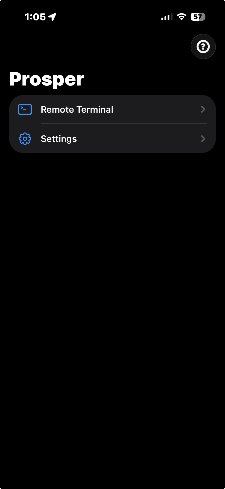
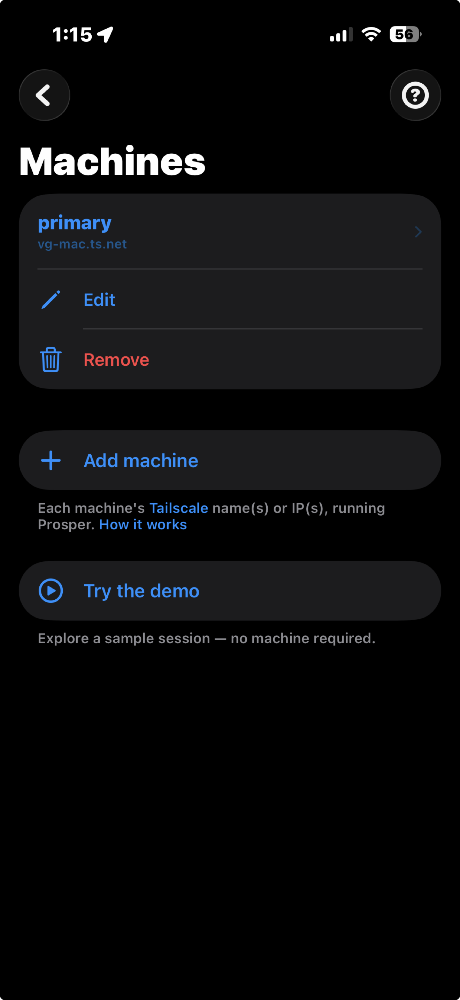
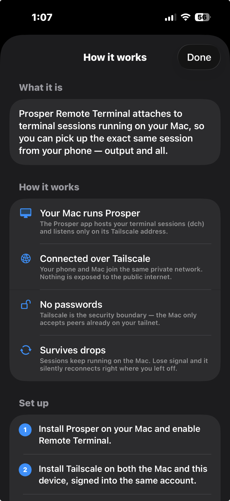
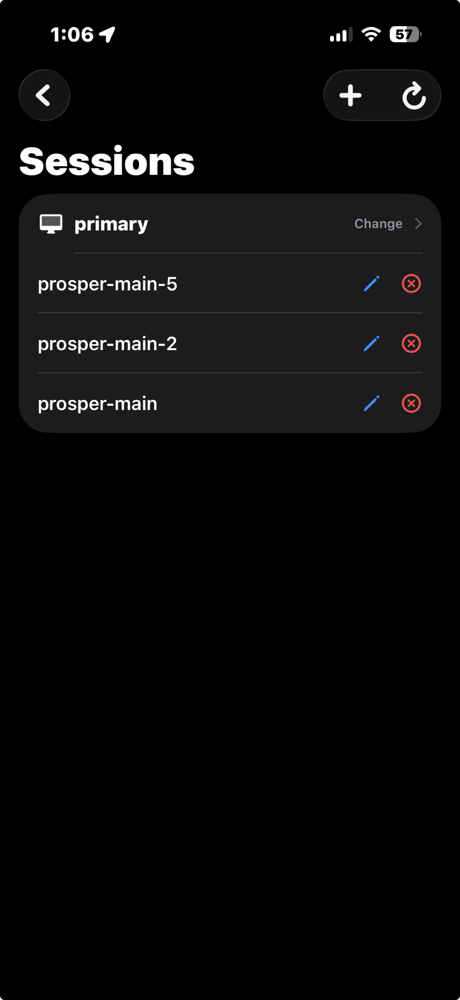
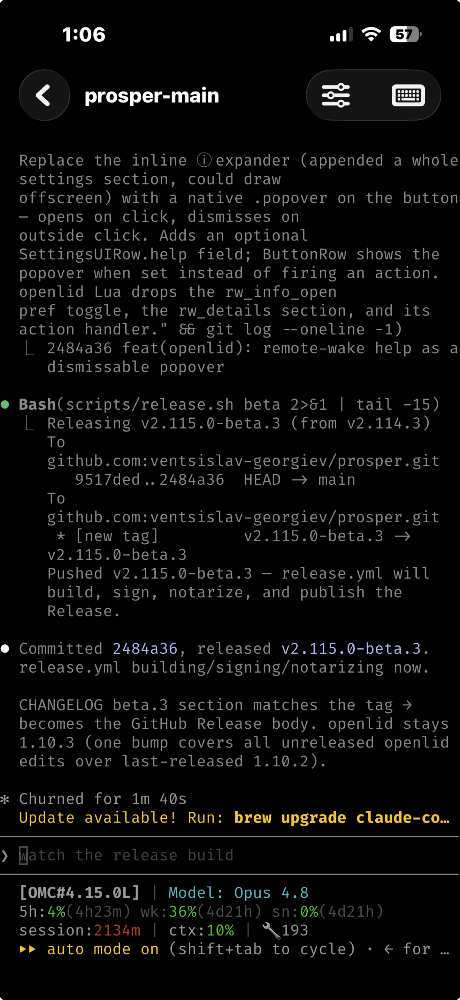
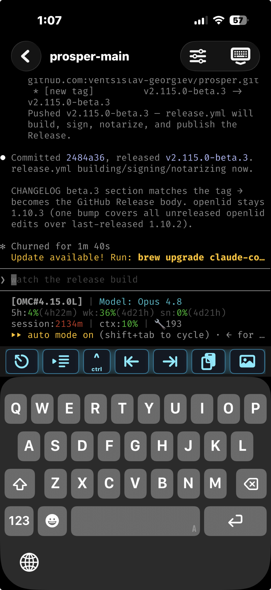

# Prosper (iOS)

Prosper for iOS / iPadOS / Mac Catalyst. A home for Prosper's mobile features.

The first feature is **Remote Terminal** — attach to long-running `dch`
(a `dtach` fork) sessions hosted by [Prosper](https://github.com/) on your Mac,
reached over [Tailscale](https://tailscale.com). No passwords: Tailscale is the
trust boundary.

- Bundle id: `eu.illegible.prosperios`
- Min iOS: 16.0 · also builds for Mac Catalyst
- Terminal rendering: [SwiftTerm](https://github.com/migueldeicaza/SwiftTerm)

## Screenshots

| Home | Machines | How it works |
|------|----------|--------------|
|  |  |  |
| **Sessions** | **Live session** | **Terminal** |
|  |  |  |

Add a machine by its Tailscale name/IP, pick a running `dch` session, and the
exact same terminal — scrollback and all — picks up on your phone. A built-in
demo session lets you explore without a Mac.

## Build & run locally

The Xcode project is generated from `app/project.yml` by
[XcodeGen](https://github.com/yonaskolb/XcodeGen) (`brew install xcodegen`).

```sh
./run.sh           # build + launch Mac Catalyst app
./run.sh ios       # iOS Simulator
./run.sh device    # sign + install on a connected iPhone (needs a team)
./run.sh build     # Catalyst build only
```

## CI/CD → TestFlight

Pushing to `main` builds and uploads to TestFlight via
`.github/workflows/testflight.yml`. Signing is fully automatic through an
App Store Connect API key — no certificates or profiles live in the repo.

See [`docs/SIGNING.md`](docs/SIGNING.md) for one-time setup of the four repo
secrets (`ASC_KEY_ID`, `ASC_ISSUER_ID`, `ASC_KEY_P8`, `APPLE_TEAM_ID`).

## License

MIT — see [`LICENSE`](LICENSE). SwiftTerm is MIT-licensed.
